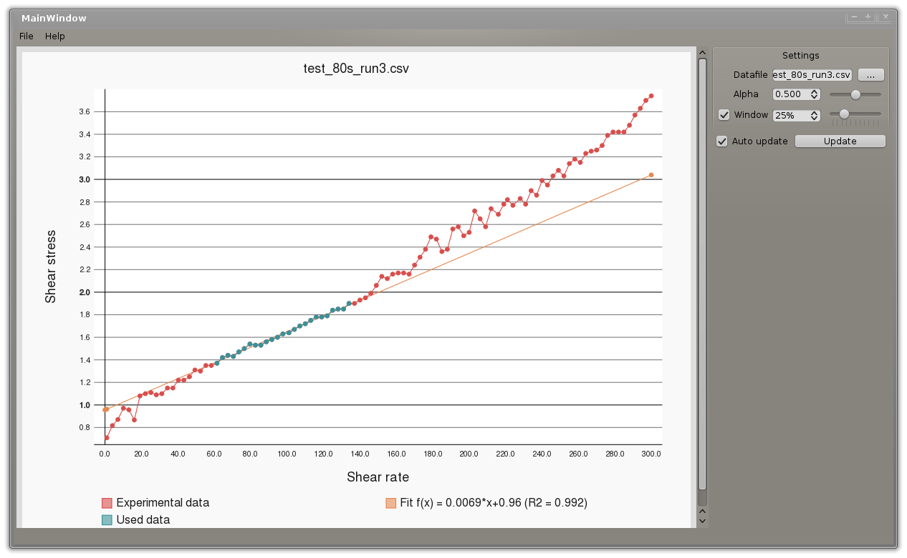

u-fit
============

A tool for automated curve fitting for certain types of experimental data

## Install
**Qt4 and PyQt4 are requiered as dependences**

To install, open a terminal and execute:
    
    sudo sh install.sh

## Execution
Open a terminal and execute:
    
    u-fit.py
